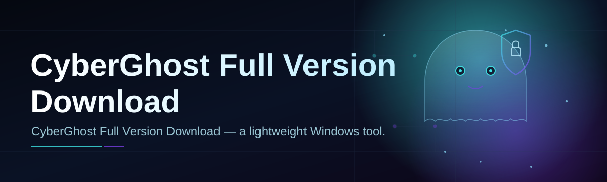
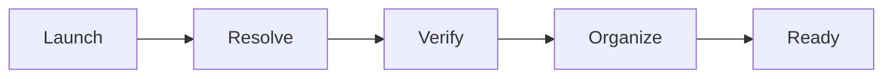

# cyberghost-suite-manager 🛡️👻

  

*One manager. One download. Zero guesswork — the fastest path from search bar to a working CyberGhost setup.*

  

---

## 🧭 What This Is NOT

This is **not** a VPN client. It is **not** a mirror of vendor installers, and it is **not** a workaround for licensing.

`cyberghost-suite-manager` is a lightweight orchestration layer that sits *around* your CyberGhost full version download — verifying the package, organizing configs, and giving you a clean dashboard instead of a folder full of `.exe` files and forgotten notes.

If you want a shady one-click "activation" tool — wrong repo. If you want a sane, auditable, well-documented way to fetch, verify, and manage a legitimate CyberGhost installation on Windows — keep reading.

---

## 🔍 Overview

Setting up a VPN suite in 2026 shouldn't feel like archaeology. Between outdated forum links, mismatched installer versions, and configuration files scattered across three folders, most people spend more time *preparing* to be private than actually being private. `cyberghost-suite-manager` exists to close that gap — it's a single, self-contained Windows utility that streamlines the CyberGhost full version download process from first click to final launch.

The project is built for privacy-conscious users, sysadmins managing multiple machines, and anyone who's tired of re-discovering the same setup steps every time they reinstall Windows. Instead of hunting for the right build, checking checksums by hand, and manually wiring up connection profiles, this manager does the boring parts — so you spend your time actually using the VPN, not configuring it.

Under the hood, it's intentionally simple: no background services, no telemetry, no hidden dependencies. Just a standalone tool that talks to a landing page, verifies what it grabs, and hands you a ready-to-run environment. Think of it less as software and more as a very organized assistant standing next to your Downloads folder.

> [!NOTE]
> The button above links to the official project landing page. That page — not this README — is the single source of truth for downloads.

---

## ⚡ What It Actually Does

- **Fetches the right build, every time.** No more guessing between mirrors — the manager resolves the correct CyberGhost full version download package for your Windows architecture automatically.

- **Verifies before it trusts.** Every package is checksum-validated before it touches your system, so you're not left wondering if the file is intact.

- **Organizes configs like a librarian.** Connection profiles, server lists, and preferences are indexed into a searchable local catalog instead of scattered `.ovpn` files.

- **Speaks one language: simplicity.** A single dashboard replaces the usual sprawl of installer wizards, license prompts, and settings tabs.

- **Respects your bandwidth.** Resumable downloads mean a dropped connection doesn't mean starting from zero.

- **Keeps a paper trail.** A local, human-readable log tracks what was downloaded, when, and from where — useful for audits or just peace of mind.

- **Stays out of your way.** No background daemons, no auto-launch on boot, no silent updates you didn't ask for.

- **Portable by design.** Runs from a single folder — move it to a USB stick, another machine, or a fresh install without reconfiguration.

---

## 🚀 How to Get Started

> [!TIP]
> Set aside two minutes. That's genuinely all this takes.

1. **Visit the landing page.** Click the download badge above — it opens the official `cyberghost-suite-manager` project page.

2. **Download the manager.** Grab the standalone Windows package. No account, no email wall.

3. **Run it.** Double-click the executable. Windows may show a SmartScreen prompt for unrecognized publishers — that's expected for small open-source tools; review the source before proceeding if you're cautious.

4. **Follow the on-screen flow.** The manager guides you through verifying and organizing your CyberGhost full version download — then you're done.

> [!IMPORTANT]
> Always download from the official landing page linked in this README. Third-party mirrors are not maintained by this project and cannot be verified.

---

## 🖥️ System Requirements

| Component | Minimum | Notes |
|---|---|---|
| OS | Windows 10 (64-bit) | Windows 11 fully supported |
| RAM | 2 GB | 4 GB recommended for smooth multitasking |
| Disk | 150 MB free | Plus space for the CyberGhost installer itself |
| Dependencies | None | Fully standalone — nothing else to install |
| Internet | Required | For initial download and verification only |

  

---

## 🛠️ How It Works

The whole process is deliberately linear — no hidden branches, no background surprises:

1. **Launch** — you open the manager, it initializes a local workspace.
2. **Resolve** — it identifies the correct CyberGhost package for your system.
3. **Verify** — checksums are compared before anything is trusted.
4. **Organize** — configs and profiles are indexed into the dashboard.
5. **Ready** — you're handed a clean, working setup.

<strong>🔬 Curious about the verification step specifically?</strong>

 

The manager computes a checksum for the downloaded package and compares it against a locally stored reference before unlocking the "Organize" step. If the checksum doesn't match — due to a corrupted download or an unexpected source — the process halts and flags the file, rather than silently continuing.

---

## 🐞 Common Pitfalls

**Q: The download stalls at a fixed percentage — what's going on?**
A: Usually a flaky connection or an overly aggressive firewall rule. Pause and resume from the dashboard; the manager resumes from the last verified byte instead of restarting.

**Q: Windows SmartScreen is blocking the executable.**
A: This is standard for smaller, independently-signed tools. Click "More info" → "Run anyway" only after you've confirmed you downloaded from the official landing page.

**Q: My antivirus flagged the manager as suspicious.**
A: False positives are common with new, lesser-known binaries — heuristic engines are cautious by nature. Submit the file for a second opinion via your AV vendor if you want extra assurance.

**Q: The dashboard shows an old cached version instead of the latest.**
A: Clear the local cache folder (shown in Settings → Storage) and relaunch. The manager will re-resolve the current package on next start.

**Q: Can I run this alongside an existing CyberGhost installation?**
A: Yes — the manager only organizes and verifies; it doesn't interfere with an already-installed client.

**Q: The app window looks blank on first launch.**
A: Give it a few seconds — the initial workspace indexing runs once and can briefly delay UI rendering on slower drives.

---

## 🎨 UI / UX Details

- **Themes:** Light, Dark, and a low-contrast "Midnight" mode for late-night setup sessions.
- **Keyboard shortcuts:**
  - `Ctrl + D` — jump straight to Download
  - `Ctrl + L` — open the activity log
  - `Ctrl + ,` — open Settings
  - `Esc` — cancel any in-progress action
- **Settings panel:** toggle resumable downloads, change the local workspace path, adjust checksum strictness.
- **Notifications:** subtle toast alerts on completion — no modal pop-up spam.

> [!TIP]
> Enable "Compact Mode" in Settings if you're running on a smaller screen or a virtual machine — it collapses the sidebar into icons only.

---

## 🤝 Contributing & Community

Contributions are genuinely welcome — this project grows through real-world usage, not just commits.

- Found a bug? Open an issue with your Windows build number and steps to reproduce.
- Have an idea? Discussions are open for feature proposals before you write code.
- Want to contribute code? Fork, branch, and submit a pull request against `main`. Keep changes focused — small, reviewable PRs merge faster.

> [!WARNING]
> Please don't submit PRs that add telemetry, auto-update mechanisms, or anything that phones home without explicit user consent. This project's whole ethos is transparency.

---

## 📜 License

Released under the [MIT License](LICENSE), 2026. Use it, fork it, build on it — just keep the license notice intact.

---

## ⚖️ Disclaimer

`cyberghost-suite-manager` is an independent, community-maintained tool and is **not** affiliated with, endorsed by, or officially connected to CyberGhost or Kape Technologies. All trademarks belong to their respective owners. This project exists solely to streamline the legitimate CyberGhost full version download and setup workflow on Windows. Use it responsibly and in accordance with the official CyberGhost terms of service.

---

